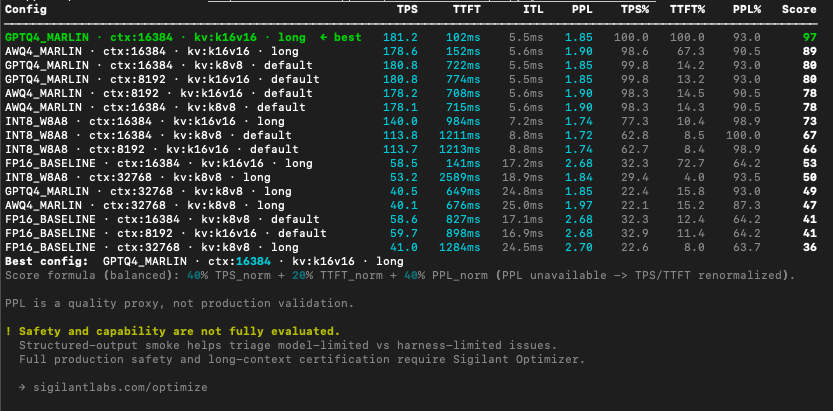
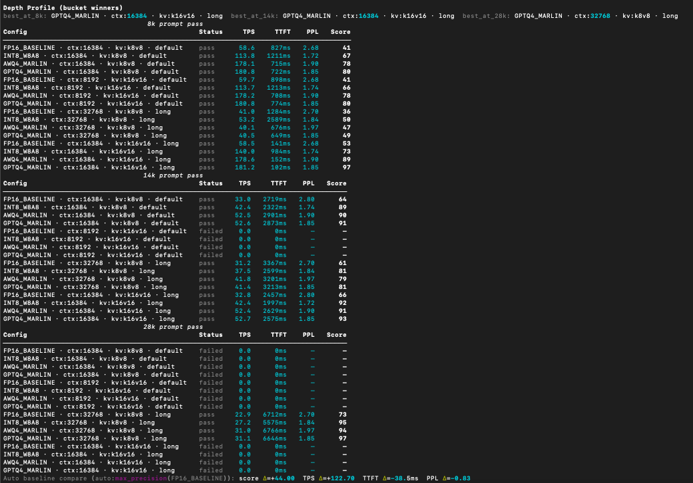

# sigilant-sweep

Evaluation orchestration for inference stacks (llama.cpp, vLLM) with Local and Modal backends: TPS, TTFT, ITL, PPL proxy, and artifacted comparisons.

[](https://pypi.org/project/sigilant-sweep/)
[](https://github.com/sigilantlabs/sigilant-sweep/blob/main/LICENSE)
[](https://github.com/sigilantlabs/sigilant-sweep/stargazers)

[Scope](#scope) • [Install](#install) • [Run paths](#run-paths) • [Metrics](#what-this-measures) • [Reproducibility](#verification-and-reproducibility)

---
## Scope

`sigilant-sweep` orchestrates config sweeps and reporting on top of existing inference engines.

It provides:
- config generation
- execution via adapters (`llama.cpp`, `vllm`)
- metric parsing (TPS, TTFT, ITL, PPL proxy)
- scoring and artifact export

It is not a new inference runtime.

## Why use this instead of running one-off engine commands

- Runs a full config grid (`quant × context × KV`) with consistent run settings.
- Uses trial-first rotated execution to reduce ordering bias across configs.
- Ranks configs on a composite score (TPS, TTFT, PPL proxy), not a single metric.
- Supports depth passes (8k/14k/28k prompts) for context-window behavior checks.
- Adds a structured-output smoke gate for quick post-ranking sanity checks.
- Exports reproducible artifacts (`json`, `md`, `svg`, terminal log) for review and sharing.

## Not in scope

- custom kernels or scheduler innovation
- replacing engine internals (`llama.cpp`, `vllm`)
- claiming production safety certification from throughput measurements

---

## Install

```bash
# Refresh installer tooling first (recommended)
python3 -m pip install -U pip

# Base (lightweight CLI + reporting)
pip install sigilant-sweep

# Hugging Face integration only
pip install 'sigilant-sweep[hf]'

# llama-cpp-python fallback only — not needed if llama-cli is on PATH
pip install 'sigilant-sweep[llama]'

# With llama-cpp-python fallback + CUDA acceleration
CMAKE_ARGS="-DGGML_CUDA=on" pip install 'sigilant-sweep[llama]'

# With vLLM (Linux + CUDA only)
pip install 'sigilant-sweep[vllm]'

# With Modal cloud backend
pip install 'sigilant-sweep[modal]'

# Everything
pip install 'sigilant-sweep[all]'
```

If your pip config points to a private/stale mirror, force official PyPI:

```bash
pip install --index-url https://pypi.org/simple sigilant-sweep
```

CLI path sanity check (recommended in every fresh venv):

```bash
hash -r
which sigilant-sweep
sigilant-sweep --version
```

If that points outside your active venv, use the explicit binary:

```bash
$VIRTUAL_ENV/bin/sigilant-sweep --version
```

---

## Run paths

Use one of these four paths:

### 1) Local + llama.cpp

```bash
python3 -m venv .venv
source .venv/bin/activate
python3 -m pip install -U pip setuptools wheel
pip install sigilant-sweep
```

Local llama.cpp execution uses `llama-cli` binary by default.

If `llama-cli` is not on `PATH`, set it explicitly:

```bash
export SIGILANT_LLAMA_CLI=/abs/path/to/llama-cli
```

If you do not have a llama-cli binary, install Python fallback:

```bash
pip install "sigilant-sweep[llama]"
```

Sanity run:

```bash
sigilant-sweep run \
  --model Qwen/Qwen2.5-1.5B-Instruct-GGUF \
  --backend local \
  --engine llama.cpp \
  --configs 1 \
  --trials 1
```

### 2) Local + vLLM (Linux + CUDA)

```bash
python3 -m venv .venv
source .venv/bin/activate
python3 -m pip install -U pip setuptools wheel
pip install "sigilant-sweep[vllm]"
```

Set family repo IDs (required for full-family runs):

```bash
export SIGILANT_VLLM_FP16_BASELINE_REPO="microsoft/Phi-3.5-mini-instruct"
export SIGILANT_VLLM_INT8_W8A8_REPO="anhbn/Phi-3.5-mini-instruct-quantized.w8a8"
export SIGILANT_VLLM_AWQ4_MARLIN_REPO="thesven/Phi-3.5-mini-instruct-awq"
export SIGILANT_VLLM_GPTQ4_MARLIN_REPO="thesven/Phi-3.5-mini-instruct-GPTQ-4bit"
```

Sanity run:

```bash
sigilant-sweep run \
  --model microsoft/Phi-3.5-mini-instruct \
  --backend local \
  --engine vllm \
  --configs 1 \
  --trials 1
```

### 3) Modal + llama.cpp

```bash
python3 -m venv .venv
source .venv/bin/activate
python3 -m pip install -U pip setuptools wheel
pip install "sigilant-sweep[modal]"
modal token new
sigilant-sweep info
```

Sanity run:

```bash
sigilant-sweep run \
  --model Qwen/Qwen2.5-1.5B-Instruct-GGUF \
  --backend modal \
  --engine llama.cpp \
  --hardware l4 \
  --configs 1 \
  --trials 1
```

### 4) Modal + vLLM

```bash
python3 -m venv .venv
source .venv/bin/activate
python3 -m pip install -U pip setuptools wheel
pip install "sigilant-sweep[modal]"
modal token new
```

Set family repo IDs (required for full-family runs):

```bash
unset SIGILANT_VLLM_FAMILY_REPOS
export SIGILANT_VLLM_FP16_BASELINE_REPO="microsoft/Phi-3.5-mini-instruct"
export SIGILANT_VLLM_INT8_W8A8_REPO="anhbn/Phi-3.5-mini-instruct-quantized.w8a8"
export SIGILANT_VLLM_AWQ4_MARLIN_REPO="thesven/Phi-3.5-mini-instruct-awq"
export SIGILANT_VLLM_GPTQ4_MARLIN_REPO="thesven/Phi-3.5-mini-instruct-GPTQ-4bit"
```

Sanity run:

```bash
sigilant-sweep run \
  --model microsoft/Phi-3.5-mini-instruct \
  --backend modal \
  --engine vllm \
  --hardware l4 \
  --configs 1 \
  --trials 1
```

### Intel macOS note (Modal extras)

If you see `Failed building wheel for cbor2`:

```bash
pip uninstall -y modal cbor2
pip install --only-binary=:all: "cbor2==5.6.5"
pip install "sigilant-sweep[modal]"
```

Then verify:

```bash
python3 -c "import modal, cbor2; print('modal', modal.__version__, 'cbor2_ok', hasattr(cbor2, 'dumps'))"
```

---

## Quick start

```bash
# 1. Check hardware and credentials
sigilant-sweep setup

# 2. Show what's detected on this machine
sigilant-sweep info

# 3. Run a sweep (local GPU, llama.cpp)
sigilant-sweep run --model mistralai/Mistral-7B-Instruct-v0.3

# 4. Save results to JSON
sigilant-sweep run --model mistralai/Mistral-7B-Instruct-v0.3 --json
```

## Example: Modal run (llama.cpp)

```bash
sigilant-sweep run \
  --model Qwen/Qwen2.5-1.5B-Instruct-GGUF \
  --backend modal \
  --engine llama.cpp \
  --hardware l4 \
  --score-profile balanced \
  --agent-smoke
```

Expected output:
- ranked config table
- recommended config + baseline delta
- artifacts: `sigilant_results.json`, `sigilant_summary.md`, `sigilant_frontier.svg`, `sigilant_terminal.txt`

Example output (truncated):

```text
Config                                           TPS     TTFT      ITL     PPL   Score
──────────────────────────────────────────────────────────────────────────────────────
Q4_K_M · ctx:16384 · kv:k16v16 · long  ← best   74.1   1728ms   13.5ms   14.32     97
Q4_K_M · ctx:8192 · kv:k16v16 · default         74.0   1729ms   13.5ms   14.32     97
Q5_K_M · ctx:8192 · kv:k16v16 · default         71.4   1792ms   14.0ms   13.61     97

Best config:  Q4_K_M · ctx:16384 · kv:k16v16 · long
Auto baseline compare (auto:max_precision(Q8_0)): score Δ=+6.00  TPS Δ=+8.20  TTFT Δ=-233.9ms  PPL Δ=+0.19
Artifacts: artifacts/runs/20260524_171722/sigilant_results.json,
          artifacts/runs/20260524_171722/sigilant_summary.md,
          artifacts/runs/20260524_171722/sigilant_frontier.svg,
          artifacts/runs/20260524_171722/sigilant_terminal.txt
```

Example artifacts bundle:

```text
artifacts/runs/20260524_171722/
  ├── sigilant_results.json
  ├── sigilant_summary.md
  ├── sigilant_frontier.svg
  └── sigilant_terminal.txt
```

## Live run examples

Full vLLM sweep example (Modal, L4):



Depth profile example (8k/14k/28k passes):



Notes:
- Captures below are from real runs of this repository.
- Results vary by model, prompt set, hardware, and backend.

Run notes:
- Default `--trials` is 12.
- Lower `--trials` for faster/cheaper sweeps; increase for stability.
- Artifacts include confidence inputs (for example top-2 gap).

## Common run patterns

### llama.cpp: single config

```bash
sigilant-sweep run \
  --model Qwen/Qwen2.5-1.5B-Instruct-GGUF \
  --backend modal \
  --engine llama.cpp \
  --hardware l4 \
  --configs 16 \
  --trials 1 \
  --only-config "Q4_K_M,8192,k16v16,default"
```

### llama.cpp depth profile

```bash
sigilant-sweep run \
  --model Qwen/Qwen2.5-1.5B-Instruct-GGUF \
  --backend modal \
  --engine llama.cpp \
  --hardware l4 \
  --configs 16 \
  --trials 5 \
  --evaluation-mode depth_profile \
  --depth-prompt-8k prompts/hard_quality_8k_prompt.txt \
  --depth-prompt-14k prompts/hard_quality_14k_prompt.txt \
  --depth-prompt-28k prompts/hard_quality_28k_prompt.txt
```

Note: with `pip install` usage from any folder, these defaults auto-resolve to packaged prompt files.
Custom prompt files can still be passed explicitly with absolute or relative paths.

### llama.cpp with structured-output smoke

```bash
sigilant-sweep run \
  --model Qwen/Qwen2.5-1.5B-Instruct-GGUF \
  --backend modal \
  --engine llama.cpp \
  --hardware l4 \
  --configs 16 \
  --trials 5 \
  --agent-smoke
```

### vLLM: full-family sweep (Modal)

```bash
unset SIGILANT_VLLM_FAMILY_REPOS
export SIGILANT_VLLM_FP16_BASELINE_REPO="microsoft/Phi-3.5-mini-instruct"
export SIGILANT_VLLM_INT8_W8A8_REPO="anhbn/Phi-3.5-mini-instruct-quantized.w8a8"
export SIGILANT_VLLM_AWQ4_MARLIN_REPO="thesven/Phi-3.5-mini-instruct-awq"
export SIGILANT_VLLM_GPTQ4_MARLIN_REPO="thesven/Phi-3.5-mini-instruct-GPTQ-4bit"

sigilant-sweep run \
  --model microsoft/Phi-3.5-mini-instruct \
  --backend modal \
  --engine vllm \
  --hardware l4 \
  --configs 16 \
  --trials 1
```

## Execution model

- CLI resolves model files, builds the config grid, dispatches to backend, and scores results.
- llama.cpp path runs timed generation and perplexity per config/trial, then aggregates (`p50`, `p95`, `mean PPL`).
- Multi-trial runs are rotated trial-first to avoid running all trials of one config back-to-back.
- Artifacts are written under `artifacts/runs/<run_id>/`.

## Troubleshooting

- `Model resolution failed: huggingface-hub is required`
: install `pip install "sigilant-sweep[hf]"` or `pip install "sigilant-sweep[modal]"`.

- `Error: modal is not installed`
: install `pip install "sigilant-sweep[modal]"`.

- `Version ... of modal is deprecated`
: upgrade modal in venv: `pip install -U modal`.

- `Failed building wheel for cbor2` (Intel macOS path)
: run
`pip uninstall -y modal cbor2 && pip install --only-binary=:all: "cbor2==5.6.5" && pip install "sigilant-sweep[modal]"`.

- vLLM local failures on macOS/Windows
: expected; run vLLM through Modal.

## Hardware options

Backend location:

| Flag                       | Where it runs          |
|----------------------------|------------------------|
| `--backend local`          | Your machine (default) |
| `--backend modal`          | Modal cloud (your account) |

GPU targets:

| `--hardware` value  | GPU              | VRAM  |
|---------------------|------------------|-------|
| `auto`              | auto-detect      | n/a   |
| `a10g`              | NVIDIA A10G      | 24 GB |
| `a100`              | NVIDIA A100      | 40 GB |
| `h100`              | NVIDIA H100      | 80 GB |
| `l4`                | NVIDIA L4        | 24 GB |
| `t4`                | NVIDIA T4        | 16 GB |
| `rtx4090`           | RTX 4090         | 24 GB |
| `rtx3090`           | RTX 3090         | 24 GB |
| `rtxa6000`          | RTX A6000        | 48 GB |

---

## Engine options

| Flag                 | Supported Backends           | Notes |
|----------------------|------------------------------|-------|
| `--engine llama.cpp` | `local`, `modal`             | GGUF-based flow |
| `--engine vllm`      | `local`, `modal`             | Linux + CUDA required |

---

## Full CLI reference

```
sigilant-sweep run [OPTIONS]

  --model      -m    HuggingFace repo ID or local .gguf path   [required]
  --backend    -b    local | modal                              [default: local]
  --engine     -e    llama.cpp | vllm                           [default: llama.cpp]
  --hardware         GPU target (see table above)               [default: auto]
  --params-b         Model size in billions (for VRAM estimate) [default: 7.0]
  --configs          Max number of configs to sweep             [default: 16]
  --confidence-target  low | medium | high                      [default: medium] (reporting only)
  --score-profile      balanced | latency | quality             [default: balanced]
  --evaluation-mode      ranking | depth_profile                [default: ranking]
  --depth-prompt-8k      Path to 8k prompt file                 [default: prompts/hard_quality_8k_prompt.txt]
  --depth-prompt-14k     Path to 14k prompt file                [default: prompts/hard_quality_14k_prompt.txt]
  --depth-prompt-28k     Path to 28k prompt file                [default: prompts/hard_quality_28k_prompt.txt]
  --only-config          QUANT,CTX,KV,REGIME                    [optional]
  --trials             Trials per config                        [default: 12]
  --json             Also write results to sigilant_results.json

sigilant-sweep setup    Check credentials for all backends (interactive)
sigilant-sweep info     Show detected hardware and installed engines
sigilant-sweep --version
```

To check the exact options in your installed version:

```bash
sigilant-sweep --help
sigilant-sweep run --help
```

---

## What this measures

| Metric | Description |
|--------|-------------|
| **TPS** | Output tokens per second |
| **TTFT** | Time to first token (ms) |
| **ITL** | Inter-token latency (ms) |
| **PPL** | Perplexity on a fixed corpus, used as a lightweight quality proxy |
| **Score** | Sigilant composite (preset-based): balanced/latency/quality profiles |

## What this does NOT measure

- Tool calling correctness
- Structured JSON / schema output validity
- Hallucination resistance
- Prompt injection resistance
- Long-context retrieval (NIAH)

PPL is a lightweight quality proxy. It is not a safety or capability evaluation.

Prompt corpus note:
- Prompt and corpus files in `prompts/` are evaluation assets for this harness.
- They are for relative config comparison, not a standard external evaluation set.

## Verification and reproducibility

- Keep raw artifacts with reported tables (`sigilant_results.json`, `sigilant_terminal.txt`).
- Re-run top candidates with `--only-config` before final selection:

```bash
sigilant-sweep run \
  --model Qwen/Qwen2.5-1.5B-Instruct-GGUF \
  --backend modal \
  --engine llama.cpp \
  --hardware l4 \
  --configs 16 \
  --trials 3 \
  --only-config "Q4_K_M,16384,k16v16,long"
```

- Separate infra/control-plane failures from model/runtime failures.
- Treat PPL as a ranking proxy within comparable runs.

PPL corpus note:
- The default PPL corpus is lightweight and coarse.
- Close winners may need higher trials and/or a larger domain-specific corpus.

Boundary:
- OSS `sigilant-sweep`: config ranking, runtime metrics, and lightweight smoke triage.
- For broader capability/safety validation on production workloads, use [Sigilant Optimizer](https://sigilantlabs.com).

### Score profiles

- `balanced`: `40% TPS + 20% TTFT + 40% PPL`
- `latency`: `50% TPS + 30% TTFT + 20% PPL`
- `quality`: `30% TPS + 20% TTFT + 50% PPL`

If PPL is unavailable, TPS/TTFT weights are renormalized automatically.

---

## License

Apache 2.0. See [LICENSE](LICENSE).
